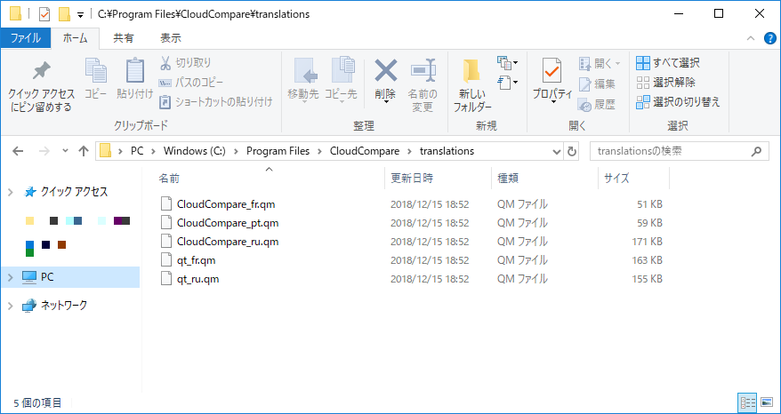
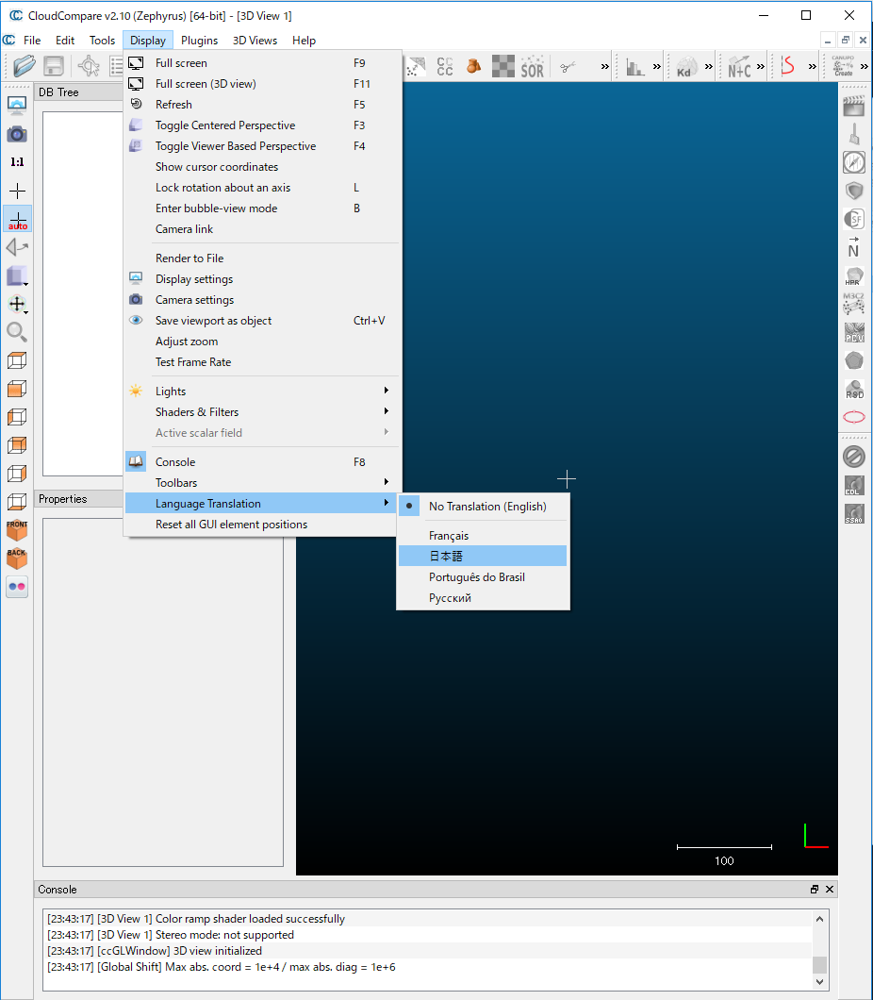

# CCCP
Open repository for CloudCompare translation into Japanese.

## GUI日本語化作業について

https://docs.google.com/spreadsheets/d/1YmojDUTQhBRndZ-kD1P8AAHxokeAo1swfNojj4N4Vo0/edit?usp=sharing

こちらのGoogleスプレッドシートにて翻訳作業を行っております。
「訳案」の欄が空欄のものを優先的に訳してください。翻訳元は左隣の列の「source」欄の内容です。

頻出単語は箇所によって訳語が異なると混乱の元となりますので、ある程度表記揺れを防ぐ必要があります。そのため、同じスプレッドシートファイル内の「単語帳（シソーラス）」タブに対訳表を用意しました。こちらを参照しながら翻訳作業を進めてください。

Let's enjoy the translation!

## 翻訳ファイルを用いてCloudCompareのGUIを日本語表示にする方法

https://www.danielgm.net/cc/

※こちらからダウンロードした標準インストーラを使用してインストールされているものとします。また、Windowsの場合について記述します。

1. まずは、**CloudCompareが起動していない状態で**、CloudCompareがインストールされているフォルダの中のGUIの言語ファイルが置かれているフォルダ（Windows10 64bitでは「C:\Program Files\CloudCompare\translations」となります）を開きます。

2. その中に、このリポジトリからダウンロードした「CloudCompare_ja.qm」ファイルをコピーします（その際に管理者権限が要求される場合がありますが、もし問題がなければ続行してください）。

3. 次に、CloudCompareを起動します。

4. ウィンドウ上部に並んだメニューの中の「Display」→「Language Translation」を開くと、その中に「日本語」という選択肢が見えるようになっているはずです。

5. 「日本語」を選んだあと、CloudCompareを再起動すれば、GUIは日本語で表示されるようになっているはずです。
    - ただし、すべての翻訳が完了するまでは一部に未翻訳のメニューが残っております。翻訳作業を進めていきましょう。
